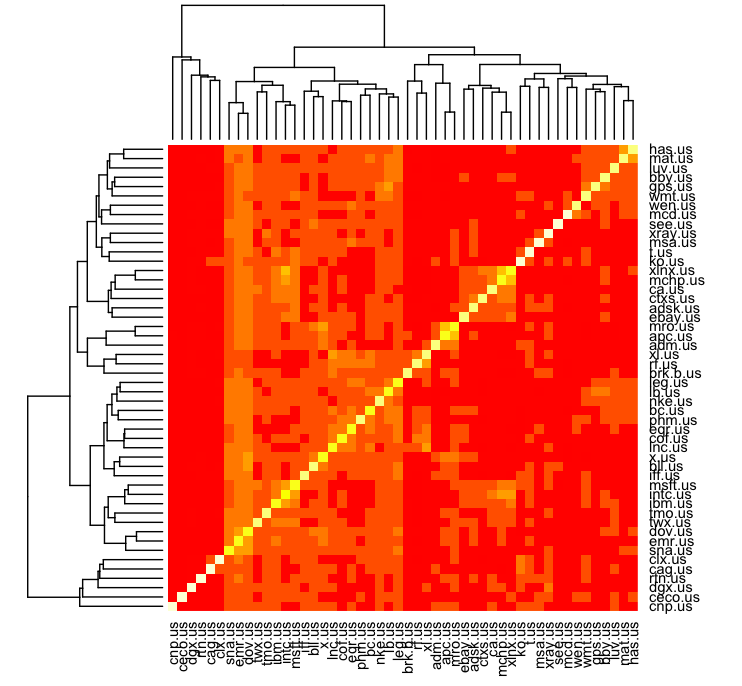
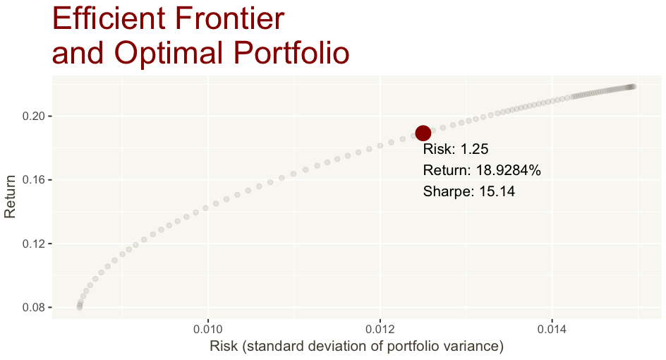
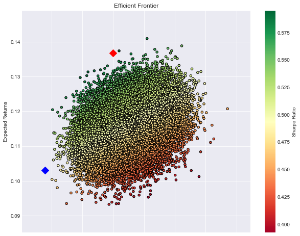

# Hierarchical Risk Parity

El modelo utilizado para solucionar el problema de asset alocation fue el hierarchical Risk Parity, este modelo fue propuesto por Marcos Lopez de Prado (["Building Diversified Portfolios that Outperform Out-of-Sample" (2016)](https://papers.ssrn.com/sol3/papers.cfm?abstract_id=2708678)). En general el modelo utiliza métodos de inteligencia artificial y grafos para solucionar el problema, el modelo se basa en arboles para reconstruir una estructura jerárquica para así restringir el movimiento de la solución del problema al existir choques en los pesos de los activos.

### Estructura del repositorio

La estructura del repositorio es la siguiente. En términos generales se utilizó el modelo de HRP y el benchmark que se utilizó fue el modelo de optimización de portafolios de Markowitz, un modelo de estos optimizando el Sharpe Ratio, el segundo optimiza la volatilidad. La estructura que se acaba de describir está desarrollada en R (en el archivo `Modelo.R`)  y replicada en python para comprobar solides de los algoritmos (en `HRP.ipynb`). En el archivo `records.csv` se encuentra el dataframe explicado las configuraciones de los diferentes portafolios generados como también sus métricas más importantes.

## Razones por las cuales se decidió construir el modelo HRP

Por lo general el modelo de markowitz es el modelo de optimización más reconocido que existe, esto ha llevado a su amplio uso por parte de los analistas financieros, al mismo tiempo que ha llevado al olvido de los problemas que posee este modelo. Entre los principales problemas encontramos desde problemas básicos relacionados con los supuestos, cómo la distribución normal y aún más preocupante, el supuesto de datos independientes e idénticamente distribuidos, y teniendo en cuenta que cada vez es más común que los portafolios posean gran número de acciones, las estructuras intrínsecas en las relaciones de los activos deberían permanecer constantes durante varios periodos de tiempo, lo cual en la vida real no ocurre. Otro problema estructural que presenta el modelo Markowitz es relacionado con las dimensiones, mientras más estas sean, las aproximaciones numéricas hechas por los computadores tienden a aumentar su tamaño que tiene como resultado modificaciones pequeñas pero que resultan significativas al hallar la inversa de la matriz de covarianza y entendiendo que este tipo de operaciones son poco estables, estos pequeños cambios resultan en cambios grandes en la inversa, en otras palabras, el portafolio óptimo puede ser solo resultado de aproximaciones numéricas, qué además se suele apoyar en el hecho de que estos tipos de portafolio pierde su optimalidad cuando se tiene en cuenta el tiempo. El modelo de HRP promete corregir estos problemas al tener en cuenta las estructuras jerárquicas y no utilizar supuestos de normalidad y de variables iid, este modelo no optimiza directamente el sharpe ratio sino intenta encontrar una distribución de los activos lo más estable posible teniendo en cuenta la relación intrínseca en la dinámica de sus retornos, de esta forma consigue un portafolio que suele tener una volatilidad menor y un sharpe ratio óptimo, pero que comparado con el portafolio óptimo de markowitz (optimizando sharpe ratio) resulta menor lo cual es de esperar.

Desde el punto de vista de las acciones utilizadas, la decisión fue tomada básicamente por la disponibilidad de la información para las acciones estadounidenses correspondientes al S&P500 y también por la restricción de tiempo, el modelo también se corrió utilizando los ETFs del mismo índice y los datos están disponibles en este repositorio.

El modelo se puede mejorar y se debería mejorar, una mejora importante sería incorporar el tiempo en el modelo al corregir los pesos generados de los portafolios según la dinámica de la función de pérdida que se defina, de la misma forma que se usa en aprendizaje de máquina con el backpropagation.

## Resultados

El portafolio que se seleccionó para este caso está compuesto de 50 acciones con un retorno de por fuera de la muestra de 18% y y un retorno (dentro de la muestra) de 9%. En la sección de composición de portafolio se ve la composición exacta del portafolio para los 50 activos seleccionados.

Como se mencionó, el modelo no busca optimizar los retornos, pero de forma indirecta consigue retornos generalmente que se encuentran entre los dos modelos utilizados por benchmark si se mide por el sharpe ratio. En las siguientes figuras se puede observar la representación de la matriz de correlaciones como mapa de calor donde se puede también observar las aglomeraciones que genera el algoritmo, también se puede observar en los bordes de la imagen la distribución jerárquica del modelo hrp sobre los 50 activos.

En la siguiente tabla se muestran los ratios del modelo para diferentes configuraciones (por cuestión de estética no se muestran todas las columnas). 


Cabe mencionar que este tipo de modelos tiene un mejor comportamiento mientras más datos se utilizan, la base de datos utilizada aquí cuenta de alrededor de 600 Mbs en datos de acciones del S&P500, claro está que después de la limpieza aplicada en este repositorio, muchos datos no cumplen con las características necesarias para ser utilizados en el modelo. 



Una característica importante del modelo que vale la pena resaltar es que, aunque no intenta optimizar los retornos, el retorno por fuera de la muestra (`return_oos` en `records`) suele se competitivo con los modelos de comparación, en muchos casos este es superior al portafolio cuyo único  objetivo es optimizar la varianza y al mismo tiempo se mantiene en los niveles similares de volatilidad (riesgo). Si se compara por el sharpe ratio (y con el respectivo modelo que optimiza este ratio) sus resultados (por fuera de la muestra) son muy optimistas, siempre ocurre que el modelo hrp supera el sharpe ratio (oos - _out of sample_) de su modelo de comparación o supera el sharpe ratio del modelo mínimo en el riesgo (que por cuestiones de dinámica de los activos supera ambos modelos)

### Estructura del portafolio seleccionado

Los pesos para las 50 acciones, en el siguiente orden:

```
 [1] "bll.us"   "tmo.us"   "ceco.us"  "emr.us"   "mchp.us"  "ibm.us"
 [7] "cnp.us"   "sna.us"   "has.us"   "lb.us"    "cof.us"   "lnc.us"
[13] "ko.us"    "clx.us"   "x.us"     "apc.us"   "intc.us"  "iff.us"
[19] "dov.us"   "xlnx.us"  "gps.us"   "wen.us"   "brk.b.us" "adm.us"
[25] "xl.us"    "t.us"     "rf.us"    "wmt.us"   "rtn.us"   "mat.us"
[31] "ebay.us"  "leg.us"   "ctxs.us"  "xray.us"  "eqr.us"   "luv.us"
[37] "mcd.us"   "dgx.us"   "bby.us"   "twx.us"   "nke.us"   "bc.us"
[43] "see.us"   "cag.us"   "adsk.us"  "msa.us"   "phm.us"   "msft.us"
[49] "ca.us"    "mro.us"
```

son respectivamente

```
 [1] 0.018022103 0.019710212 0.011754940 0.014121573 0.007604949
 [6] 0.026876473 0.020562459 0.013164212 0.020032061 0.008757810
[11] 0.004498418 0.003638323 0.054550348 0.066217343 0.004817607
[16] 0.008482951 0.015596686 0.024876230 0.021315107 0.006557886
[21] 0.016708810 0.012724280 0.041214119 0.019988109 0.004318081
[26] 0.034007180 0.004225616 0.050045325 0.044322342 0.019075856
[31] 0.011446963 0.020154215 0.007983988 0.023815873 0.012962359
[36] 0.016945941 0.029598422 0.039720647 0.011225476 0.020058699
[41] 0.024433902 0.005258499 0.016203016 0.064112061 0.015354838
[46] 0.018046830 0.005014888 0.018880822 0.011067199 0.009927953
```

las diferentes métricas para el modelo se pueden observar bajo el índice 7 en la table correspondiente al archivo `records.csv`.

## Como ejecutar el código

Personalmente prefiero el código de R, pero si la curiosidad gana también están las instrucciones de como ejecutar el código en python.

### R

Para correr los resultados vistos aquí solo es necesario correr todo el archivo `Model.R`. Si no cuentas con las librerías que se usan por favor seguir leyendo.

Las únicas librerías que se están usando en R son `ggplot2` y `quadprog`, ambas librerías son muy comunes y no sería problema instalarlas sin problema, se recomienda instalarlas automáticamente usando el Package Installer default de R o cualquier distribución con la que estés acostumbrado, si este no es el caso los paquetes se puedes descargar en los siguientes links [ggplot2](https://cran.r-project.org/web/packages/ggplot2/index.html) y [quadprog](https://cran.r-project.org/web/packages/quadprog/index.html) (no se agrega el paquete porque depende de la distribución de R y del sistema operativo que estés usando, para el desarrollo de este modelo se utilizaron las versiones 2.2.1 y 1.5-5 respectivamente)

### Python

Python se utilizó para confirmar la solides de los algoritmos utilizados en R y se recomienda revisar el código únicamente, para ejecutarlo es necesario que el usuario esté cómodo utilizando python y jyputer notebooks, para revisar el código ejecutado en python se puede revisar el documento html `HRP.html`, para ejecutar el código por favor seguir leyendo (no se utilizó python plano debido a las gráficas).

Para poder correr los modelos que se utilizaron bajo el lenguaje de programación Python es necesario tener instalado los siguientes paquetes (aparte de python la versión más actual de python 2.7):
1. `jupyter`
1. `matplotlib`
2. `pandas`
3. `pickle`
4. `numpy` 
5. `scipy`

dependiendo de la distribución y configuración del sistema operativo, se puede utilizar el siguiente comando desde la terminal `pip install [nombre del paquete]` o en raros casos `pip2 install [...]` o incluso `pip2 install [...]`. Para instalar python se recomienda seguir los pasos de instalación en la pagina oficial ([link](https://www.python.org/downloads/))

Una vez los paquetes se hayan instalado, se puede usar en la terminal desde la carpeta raíz de este repositorio el comando `jupyter notebook` para ejecutar la interfaz gráfica e interactiva de python.

Una vez jupyter se haya lanzado, por favor seleccionar el documento `HRP.ipynb`, para ejecutar el modelo se debe ejecutar todas las líneas desde `Kernel >> Restart & Run All`

## Otros modelos utilizados

Como se mencionó en la introducción, el punto de comparación que se utilizó fueron dos modelos de markowitz, uno optimizando el Sharpe Ratio y el segundo optimizando su volatilidad (i.e. disminuyendo el riesgo), solo cabe mencionar dos puntos, el primero: para el cálculo del ratio se supuso una tasa libre de riesgo en benchmark de cero para simplificar cálculos, y el segundo punto es sobre la implementación del modelo de markowitz en python, es una versión simplificada ya que no soluciona la función cuadrática del modelo sino que en cambio utiliza un muestreo aleatorio amplio sobre el espacio para generar el espacio desde donde se elegirán los diferentes portafolios.

Otros modelos de composición similar que se pueden utilizar para comparación se pueden observar en la siguientes dos gráficas



los pesos para la imagen superior son 

```
0.37331245506003, 0.0388079185927766, 1.77375172545849e-18, -9.0159549551156e-17, -1.46878096092638e-17, 1.35516937029089e-16, -3.48024647580439e-17, 2.79923908729181e-17, 0.0162032086769493, 5.37573796741974e-18, 4.3961768290949e-17, -6.81172082801355e-18, 2.13515164848069e-18, 0.0648674054043085, 3.32733319650618e-17, 2.60629231584115e-17, -4.9685830081388e-17, -9.67263641791431e-18, -1.0332448869416e-16, -1.08131993027855e-17, -7.83808650513392e-17, -4.60753256702547e-18, 1.77006300485924e-18, 0.0418323149722401, -2.98368786170083e-17, -6.39388534944811e-17, 2.84680701705873e-17, 3.14139546559207e-19, 0.0288917444648228, -1.0361708290356e-16, 2.15058738832291e-18, -7.33552578004205e-18, 3.49730476793737e-19, -1.48124846823447e-18, 1.69168805314187e-17, -3.42627370134174e-17, 0.113677575220815, 2.11162616779212e-18, -3.18947696404757e-17, 1.05946459960924e-16, 0.180671178154267, 7.46968805536855e-18, -1.36764140773085e-16, 5.1357678558272e-17, 0.0405917403143562, 0.101144459139435, -7.30851524232308e-17, -9.02605111014597e-17, 2.39846056866646e-17, -7.91890765599068e-17
```

para las acciones (respectivamente): 
```
bll.us, tmo.us, ceco.us, emr.us, mchp.us, ibm.us, cnp.us, sna.us, has.us, lb.us, cof.us, lnc.us, ko.us, clx.us, x.us, apc.us, intc.us, iff.us, dov.us, xlnx.us, gps.us, wen.us, brk.b.us, adm.us, xl.us, t.us, rf.us, wmt.us, rtn.us, mat.us, ebay.us, leg.us, ctxs.us, xray.us, eqr.us, luv.us, mcd.us, dgx.us, bby.us, twx.us, nke.us, bc.us, see.us, cag.us, adsk.us, msa.us, phm.us, msft.us, ca.us, mro.us
```



## Disclaimers

En relación al código utilizado en los modelos de python es necesario mencionar que el modelo de markowitz está basada en el código del [este](https://github.com/PyDataBlog/Python-for-Data-Science) repositorio mientras que el código utilizado para hrp se base en el modelo original propuesto por Marcos Lopez de Prado

Por el lado de los modelos utilizados en R, estos están basados en el algoritmo origina del siguiente [link](http://economistatlarge.com/portfolio-theory/r-optimized-portfolio) y con respecto al algoritmo utilizado para el modelo de markowitz y graficar la frontera eficiente, el código se basó del algoritmo original de [aquí](https://residualmetrics.com/index.php/featured-home/10-finance-markets/39-testing-the-performance-of-hierarchical-risk-parity-for-portfolio-optimisation-using-jse-shares) el cual también está basado directamente en el algoritmo original propuesto por Marco Lopez de Prado.

Por último es necesario revisar la implementación del ratio de volatilidad en python para corregir algunas diferencias que se han presentado.
